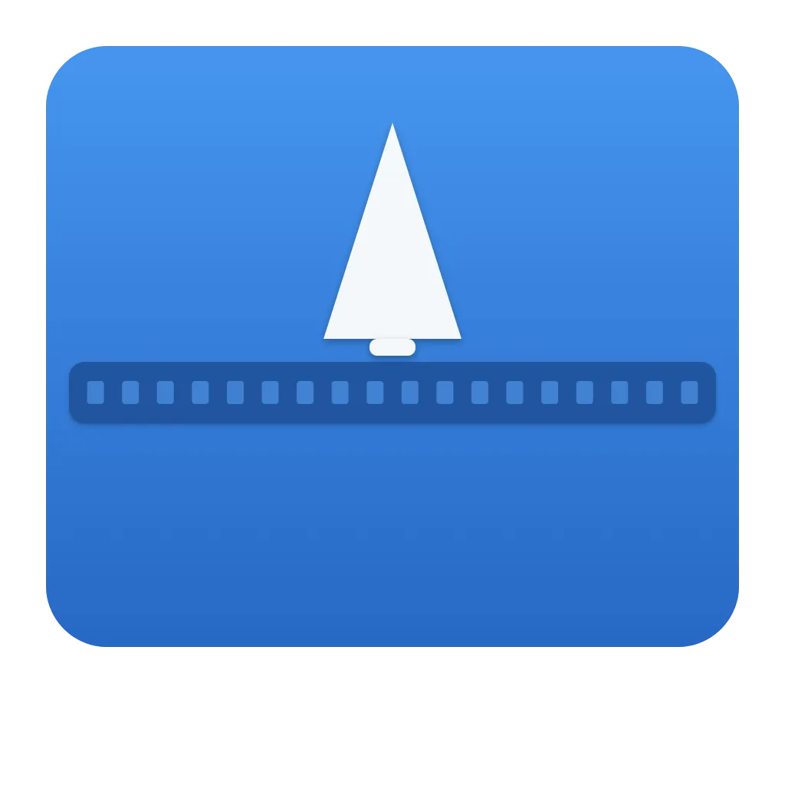

# Decompress

<p align="center">
  
</p>

<p align="center">
  
  
  
  
</p>

A native macOS decompression tool built with SwiftUI — no ads, no subscriptions, just drag-and-drop extraction.

## Features

- **Drag & drop** or file picker to select archives
- **Auto-detect format** by file extension and magic bytes
- **Extract to source directory** or custom location
- **Progress tracking** during extraction
- **Multiple formats**: ZIP, TAR, GZIP, BZIP2, XZ, 7Z, RAR
- **Auto-close on double-click**: Opening archive via double-click extracts, reveals folder in Finder, then quits
- **Native macOS UI** — built with SwiftUI, follows platform conventions

## Requirements

- macOS 15 (Sequoia) or later
- Xcode 16+ (for development)

## Dependencies

This project has no runtime dependencies. All archives are handled via built-in system tools (`/usr/bin/ditto`, `/usr/bin/tar`, `/usr/bin/unzip`, `/usr/bin/unar`).

For development:

- **Xcode 16+** — required for `xcrun swift-format` (formatting/lint), runtime, and XCTest

## Build & Run

```bash
make build         # swift build (debug)
make build-strict  # swift build -Xswiftc -strict-concurrency=complete
make release       # swift build -c release
make run           # build + bundle .app + open
```

## Test

```bash
make test           # swift test --verbose
make test-coverage  # swift test --enable-code-coverage + llvm-cov report
```

## Format & Lint

```bash
make format       # xcrun swift-format format --in-place Sources/ Tests/
make format-check # xcrun swift-format lint --recursive Sources/ Tests/
```

## Full CI Gate

```bash
make check  # format-check → build-strict → test-coverage
```

## Project

```bash
make session <branch>  # start a new dev session
make version           # show current version from Info.plist
make bump-version V=x.y.z  # bump version in Info.plist
make clean             # swift package clean && rm -rf .build
```

## Pre-commit / Pre-push Hooks

Enable hooks via `git config core.hooksPath .githooks`:

- **pre-commit**: runs `swift-format format --in-place`, `swift-format lint`, `swift build -Xswiftc -strict-concurrency=complete`
- **pre-push**: runs `swift test --verbose`

Skip hooks with `--no-verify`.

## Project Structure

```
Sources/Decompress/
├── App/DecompressApp.swift
├── Helpers/
│   ├── AppVersion.swift
│   ├── ButtonStyles.swift
│   ├── Colors.swift
│   ├── DesignConstants.swift
│   ├── Loc.swift
│   ├── View+Backgrounds.swift
│   └── VisualEffectBackground.swift
├── Models/
│   ├── ArchiveEntry.swift
│   ├── ArchiveFormat.swift
│   └── ExtractionResult.swift
├── Services/
│   ├── ArchiveFormatDetector.swift
│   ├── DecompressionService+ContentListing.swift
│   ├── DecompressionService+ProcessRunner.swift
│   ├── DecompressionService.swift
│   ├── FileManager+Extensions.swift
│   └── ServiceError.swift
├── ViewModels/
│   └── DecompressViewModel.swift
├── Views/
│   ├── ArchiveContentView.swift
│   ├── ContentView.swift
│   ├── DragDropView.swift
│   ├── ExtractionCompletedView.swift
│   ├── ExtractionFailedView.swift
│   ├── ExtractionProgressView.swift
│   ├── FileRowView.swift
│   ├── HelpView.swift
│   ├── PasswordPromptView.swift
│   └── SettingsView.swift
├── Tests/
│   ├── DecompressTests/
│   │   ├── ArchiveFormatTests.swift
│   │   ├── DecompressionServiceTests.swift
│   │   └── DecompressViewModelTests.swift
│   └── DecompressUITests/
│       └── DecompressUITests.swift
├── scripts/
│   ├── make-app-bundle.sh
│   └── start-session.sh
├── support/
│   └── Info.plist
├── docs/
│   ├── DEVELOPMENT_PLAN.md
│   └── UI-UX-DESIGN-REVIEW.md
├── .github/
│   ├── workflows/ci.yml
│   ├── ISSUE_TEMPLATE/
│   │   ├── bug_report.md
│   │   └── feature_request.md
│   └── PULL_REQUEST_TEMPLATE.md
├── .githooks/
│   ├── pre-commit
│   └── pre-push
├── CODE_OF_CONDUCT.md
├── CONTRIBUTING.md
├── LICENSE
├── Makefile
├── Package.swift
├── SECURITY.md
├── SPEC.md
└── SUPPORT.md
```

## CI

GitHub Actions runs on `macos-15`:

1. `make format-check`
2. `make build-strict`
3. `swift test --enable-code-coverage` + `llvm-cov` report
4. On `v*` tags: release build + `.app` bundle + GitHub Release

## Contributing

Contributions are welcome! Please read our [Contributing Guidelines](CONTRIBUTING.md) first.

## Security

To report security vulnerabilities, please see our [Security Policy](SECURITY.md).

## Code of Conduct

This project follows the [Contributor Covenant Code of Conduct](CODE_OF_CONDUCT.md).

## License

This project is licensed under the MIT License - see the [LICENSE](LICENSE) file for details.
