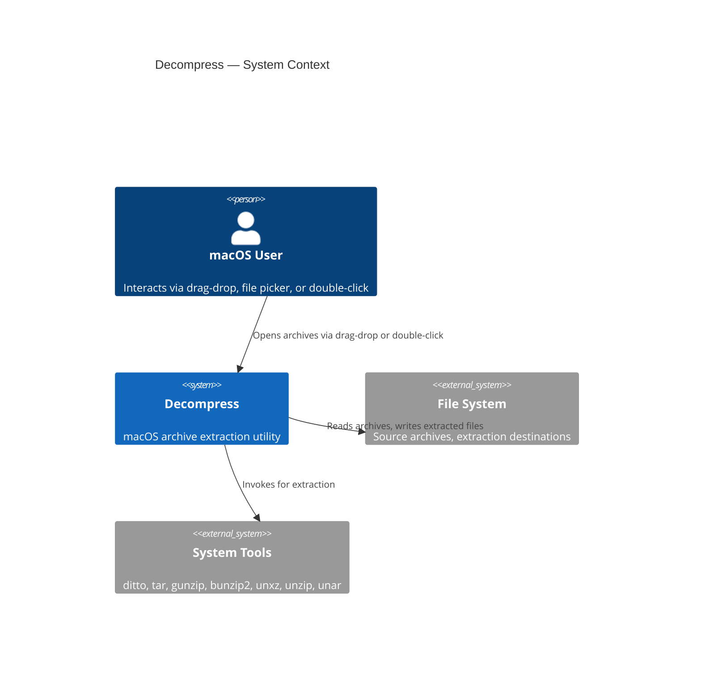
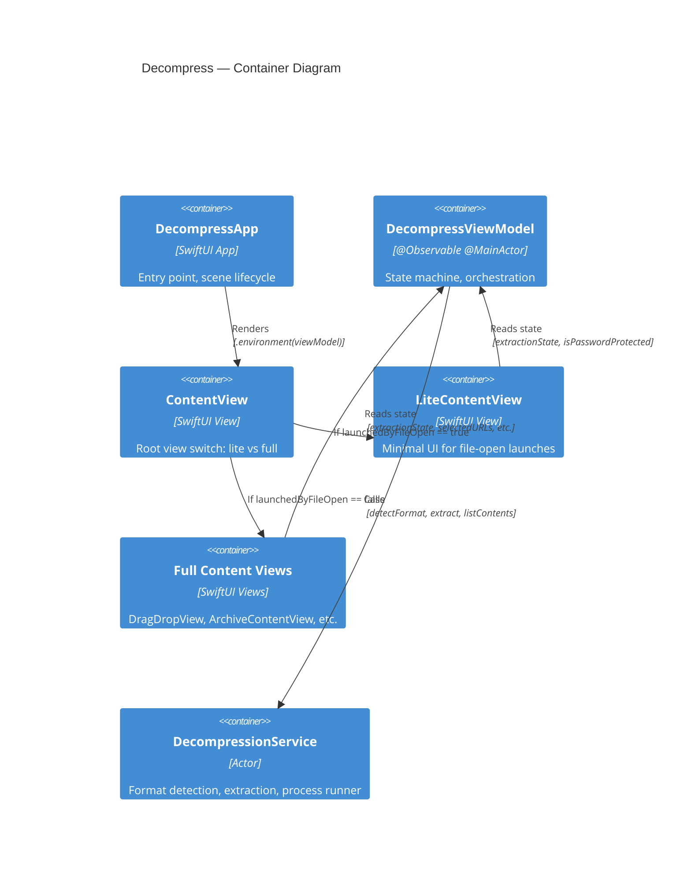
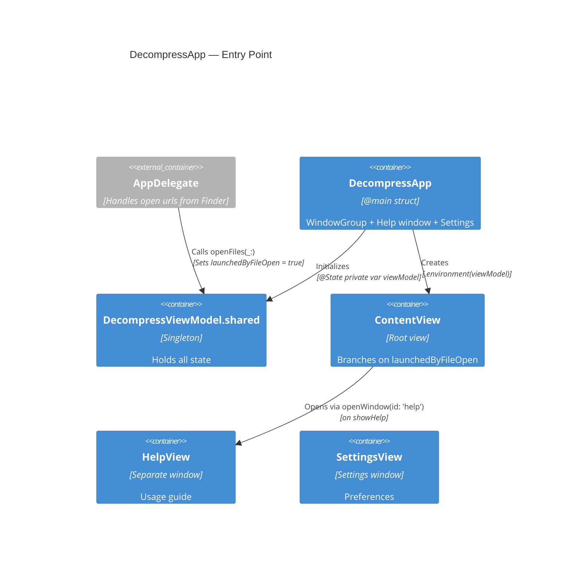
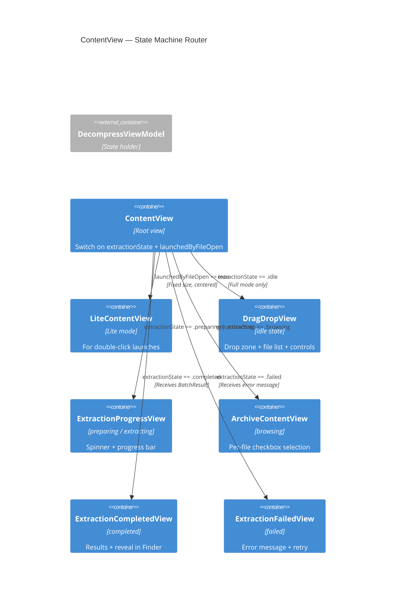
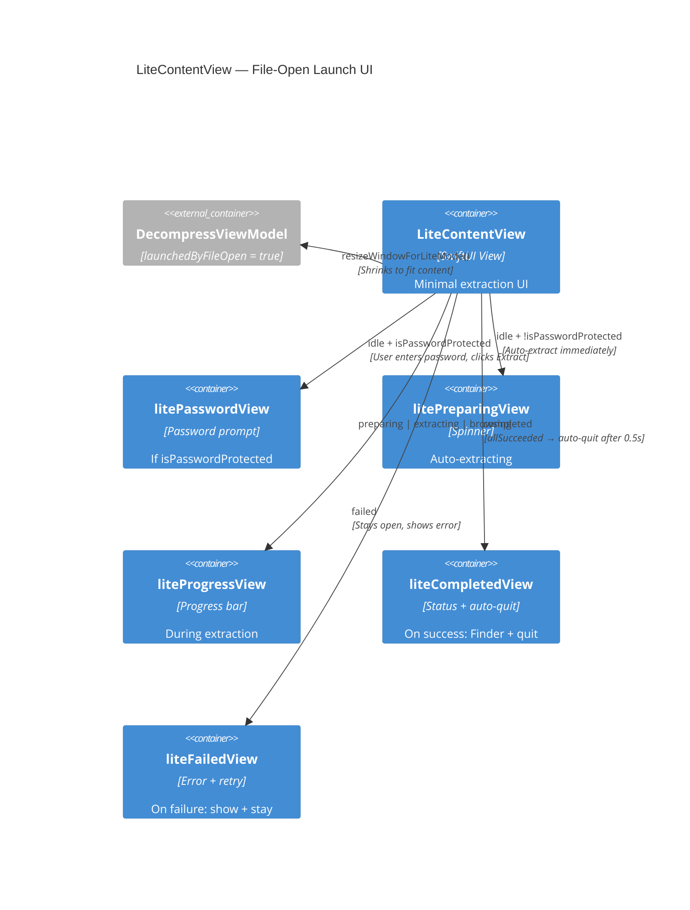
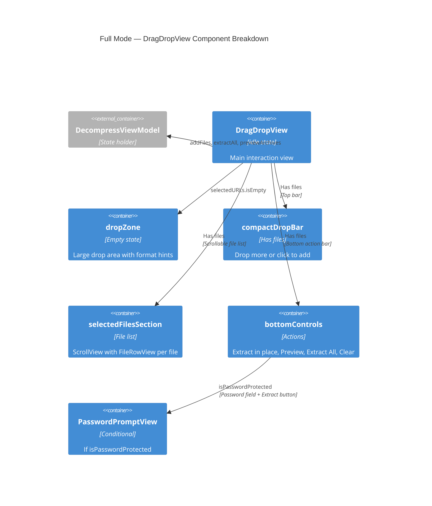
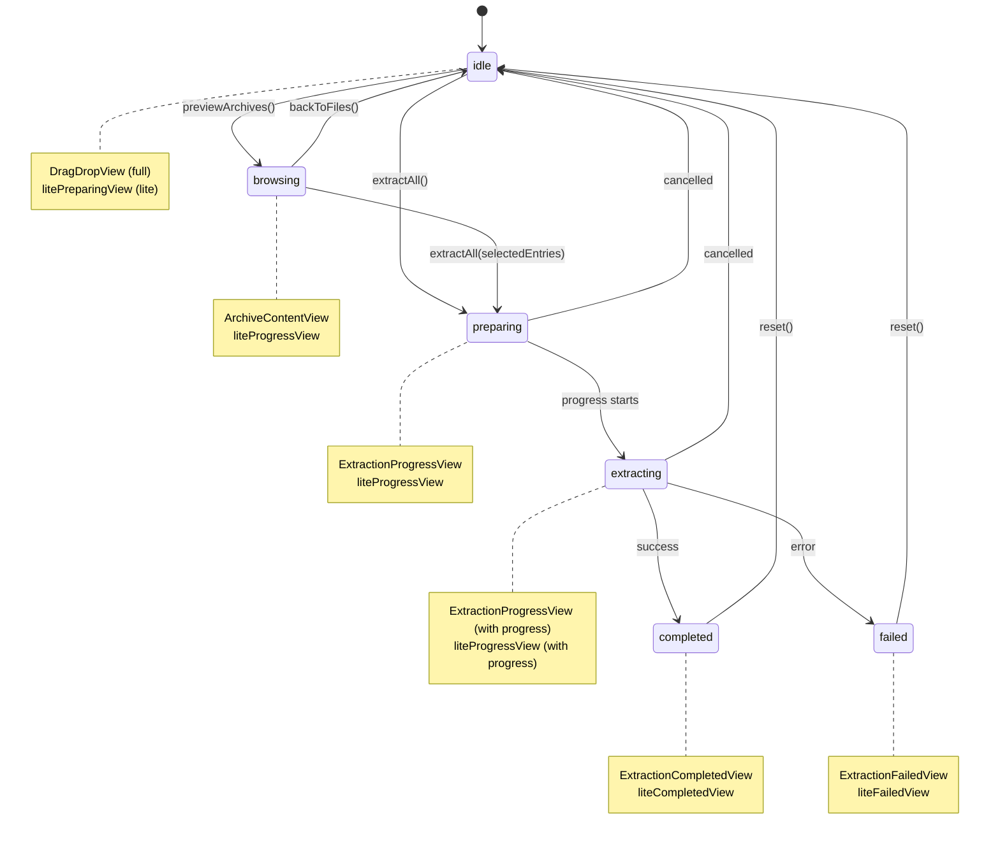
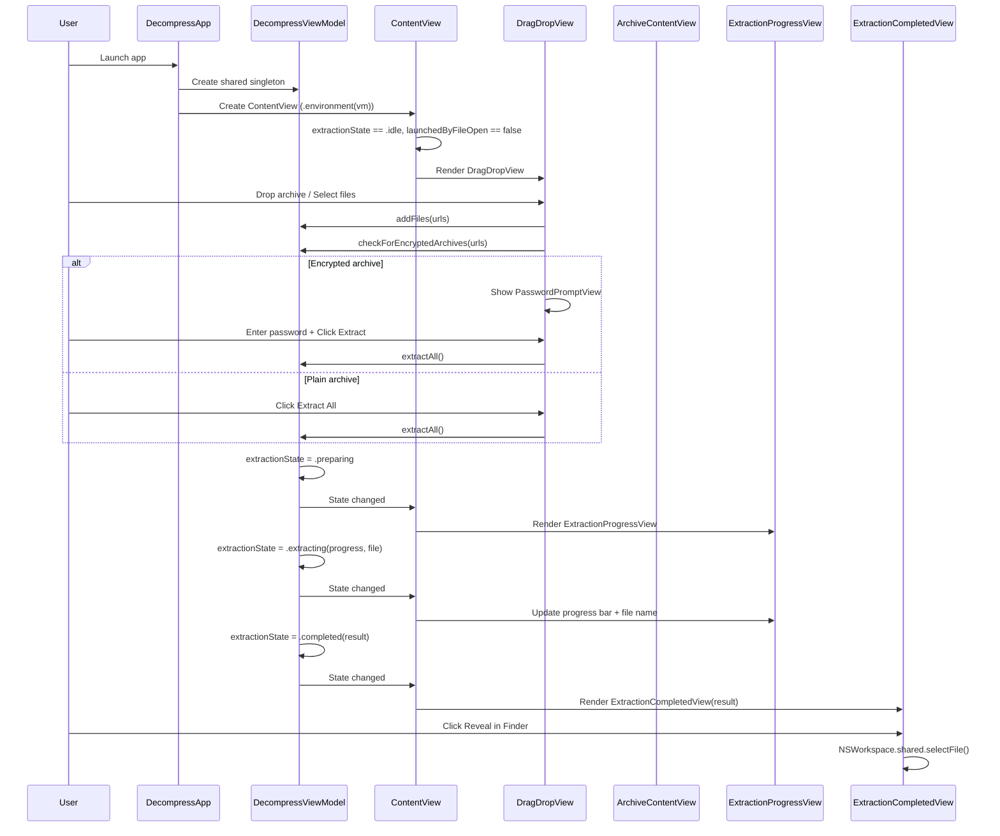
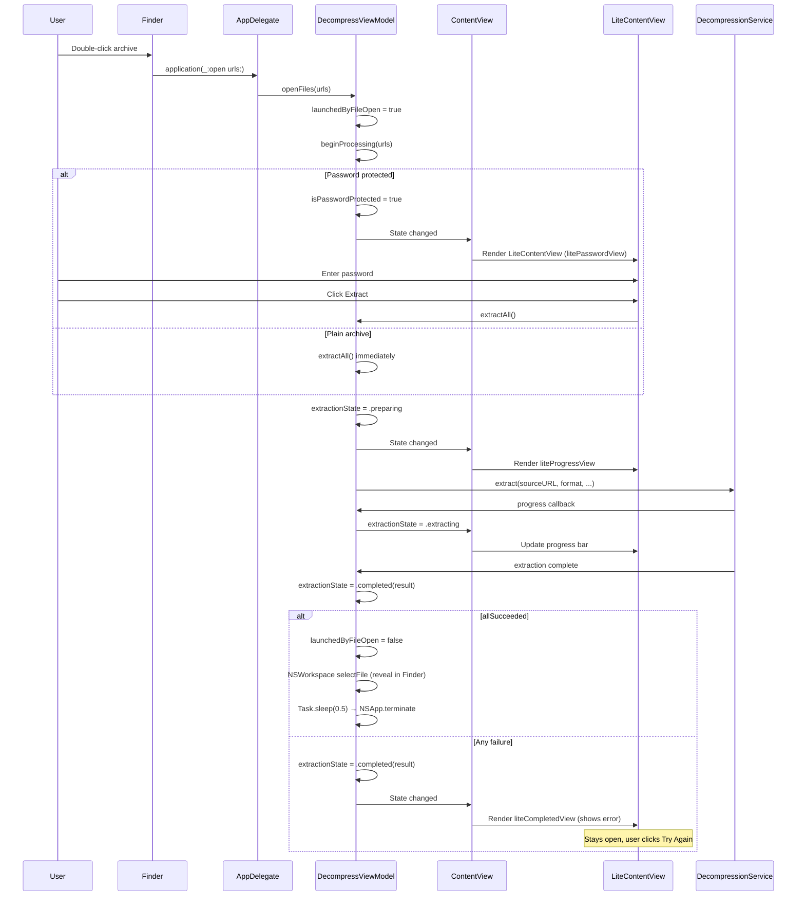

# Decompress — UI Loading Sequence (C4 Diagrams)

## Level 1: System Context



## Level 2: Container Diagram



## Level 3: Component Diagram — App Entry



## Level 3: Component Diagram — ContentView Branching



## Level 3: Component Diagram — LiteContentView



## Level 3: Component Diagram — Full Mode Views



## Extraction State Machine



## View Loading Sequence — Full Mode



## View Loading Sequence — Lite Mode (Double-Click)



## State → View Mapping Summary

| State | Full Mode View | Lite Mode View |
|-------|---------------|----------------|
| `.idle` | `DragDropView` | `litePasswordView` (encrypted) / `litePreparingView` (plain) |
| `.preparing` | `ExtractionProgressView` (spinner) | `liteProgressView` (spinner) |
| `.extracting` | `ExtractionProgressView` (progress bar) | `liteProgressView` (progress bar) |
| `.browsing` | `ArchiveContentView` | `liteProgressView` (fallback) |
| `.completed` | `ExtractionCompletedView` | `liteCompletedView` (auto-quit on success) |
| `.failed` | `ExtractionFailedView` | `liteFailedView` (stays open) |

## Launch Path Decision

```
App Launch
  ├── launchedByFileOpen == false → Full Mode (DragDropView)
  │     └── User drops/selects files
  │           ├── Encrypted → PasswordPromptView → extractAll()
  │           └── Plain → Extract All button → extractAll()
  │
  └── launchedByFileOpen == true → Lite Mode (LiteContentView)
        ├── Encrypted → litePasswordView → Enter password → extractAll()
        └── Plain → Auto extractAll() immediately
              ├── Success → auto-quit after 0.5s
              └── Failure → liteCompletedView (stays open)
```
